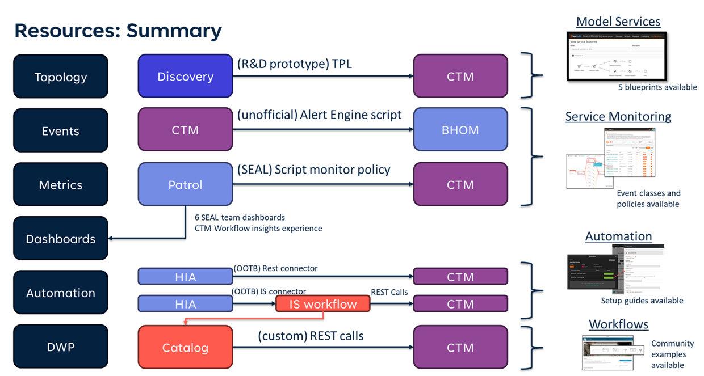
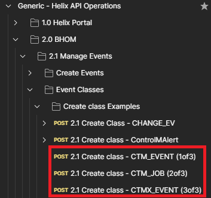

# BMC Control-M and Helix Integration Resources

Unofficial integration resources between BMC Control-M and BMC Helix Discovery and AIOps.

Do note that all of these resources are prototypes and not suported by anyone, but have been used in live environments.
[See License for disclaimers.](LICENSE)

## 🧭 Topology

Using Helix Discovery to discovery Control-M jobs and mapping them in services.

### 🔍 Discovering Control-M with Helix Discovery
[TPL Folder](tpl/) container beta version of the TPL for discovering Control-M jobs and folders into DSM.

Usage steps:
1) Import TPLs
2) Add to outpost Control-M API Credentials
3) Add to outpost SSH/windows credentials for hosts running Control-M/Server, EM, and agents (if not already configured)
4) Run discovery scan against hosts running Control-M Server, EM, and agents. (TPLs only trigger if at least one EM and one server software instances are found and modeled)
5) Search for "Control-M Job". If any were discovered and modeled they'll be under "Deployment".
6) Open visualization for any job.
7) Change "Display" option to "All directly connected nodes->Directly Connected"

Jobs (Deployments) will be connected to Collections: Folders, subfolders, applications, and subapplications.

Jobs may also be connected to Control-M/Server and Agent responsible for it.

Jobs may also be connected to connection profiles.

### 📐 Modeling Services using Blueprints

[Blueprints folder](blueprints/) contains options to model Control-M workflows as a service from different starting points:
- Using Application attribute of jobs and folders
- Using Subapplication attribute of jobs and folders
- From an initial Folder (+ 2 subfolders)
- From an SLA Service job
- Control-M Server to all jobs it orquestrates

## 👁️ Monitoring / Observability

Using Helix AIOps to monitor Control-M

### 🚨 Events

Event classes need to be created in BHOM.

Control-M Alert Engine needs to be configured to forward alerts as events to BHOM.
- The Alert Engine can be configured to trigger a script whenever alerts are created, updated, and closed.
- It’s the same mechanism that some customers use to open incidents in Helix ITSM.
- A common usage pattern is for the initial script, which the Engine calls, to be configured to call other scripts specific for each desired actions (create incident, send alert to bhom, invoke SMS service, etc).  

#### 🧩 Event Classes

Used for BHOM events created by Control-M alert engine scripts.

1) Download the postman collection from the link below and import into Postman

https://github.com/rulhoa/bmc-helix-postman-collections

2) In postman, search for "Create Class"

You should find requests to create the following classes:
- CTM_EVENT
- CTM_JOB
- CTMX_EVENT

Create them in order.

#### 🔔 Control Alert Engine Scripts

Recommended the usage of:

https://github.com/dcompane/controlm_toolset/tree/main/sendAlarmToScript/Python/BHOM

There is also an official version in the public Control-M repo, but it doesn't provide enough information to events for BHOM to uniquely lookup the alerting job in DSM (Discovery):

https://github.com/controlm/automation-api-community-solutions/blob/master/helix-control-m/2-external-monitoring-tools-examples/alerts-to-bhom/README.md

#### 📏 Event Policies

[Event policy](event_policies/) that deduplicates CTM events and does discovery node lookup refinements. The lookup seeks to match events with the corresponding CI (job, folder, agent, etc) in Discovery

## 📊 Metrics

[Monitor policy definition](monitor_policies/) for collecting metrics from Control-M using the script KM to query Control-M APIs.

Pre-req: Helix Monitor Agent (Patrol Agent) needs to have been installed, on a host with access to Control-M/EM, with the script KM.

## 📈 Dashboards

Using Helix Dashboards (Grafana based) to track Control-M metrics.

This folder for [Helix Dashboards](dashboards/) contains exampples that leverage metrics collected by the monitor_policies for a Control-M Workflow Insights experience inside Helix.

## 🤖 Automation

Example of using Helix Intelligent Automation to trigger on Control-M events in Helix AIOps.

[Step-by-step guide on setting up HIA connectors](hia/). The guide is much more wide ranging and includes steps on:
- Using the generic_rest connector with Control-M;
- Using HIA and Innovation Studio workflows with Control-M.
