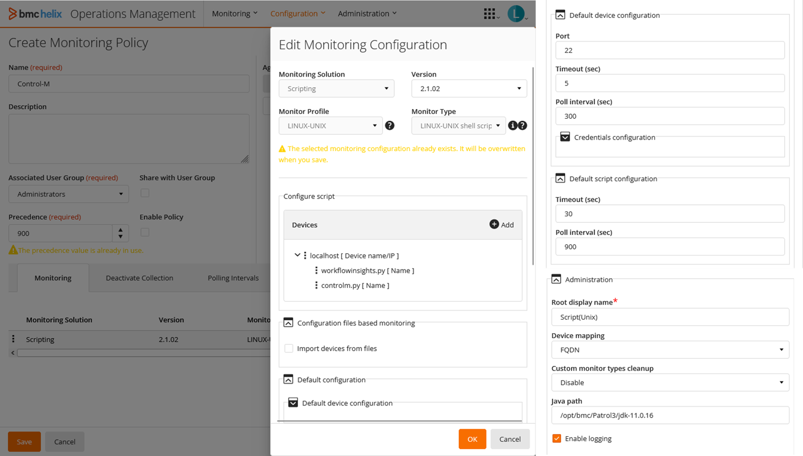
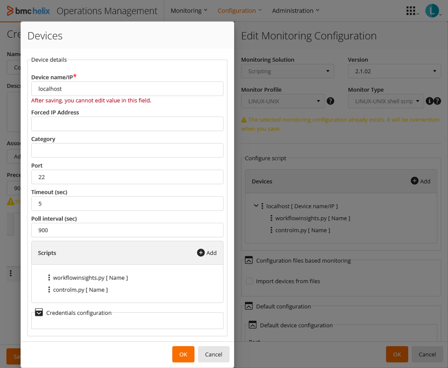
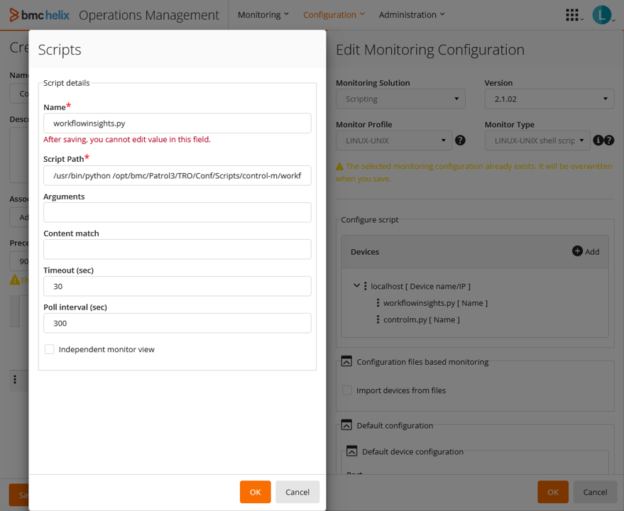
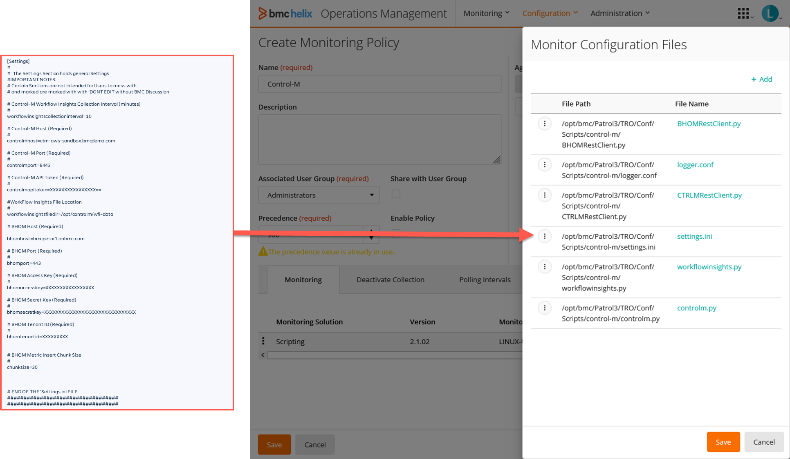

Monitor Policy configuration screenshots

1) 

2) 

3) 

`/usr/bin/python /opt/bmc/Patrol3/TRO/Conf/Scripts/control-m/workflowinsights.py -d`

4) 

`/usr/bin/python /opt/bmc/Patrol3/TRO/Conf/Scripts/control-m/controlm.py -d`

5) 

Remember to edit the "settings.ini" file with the information of your environment before adding it to the policy.
All files are automatically downloaded by the agent.
